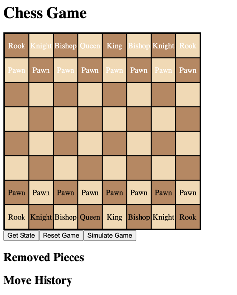
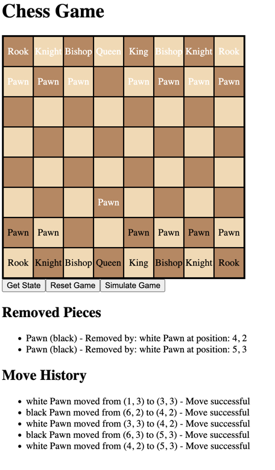

# FDChess

FDChess is a simple C# Web API project that provides a RESTful API for a chess game. The API allows you to create a new game, make moves, and get the current state of the game.

## Getting Started
Run either the `FDChess.sln` solution file or the `FDChess.csproj` project file in Visual Studio. The project will start a local web server that listens on port 5000.

## API Endpoints
### Create a new game
```
POST /api/games
```
Creates a new game and returns the game ID.

### Get the current state of the game
```
GET /api/games/{gameId}
```
Returns the current state of the game.

### Make a move
```
POST /api/games/{gameId}/moves
```
Makes a move in the game. The request body should contain the move in algebraic notation (e.g. "e2e4").

## Example
1. Create a new game
```
POST /api/games
```
Response:
```
{
    "gameId": "1"
}
```

2. Get the current state of the game
```
GET /api/games/1
```

## Frontend is currently under development and made in Angular:

